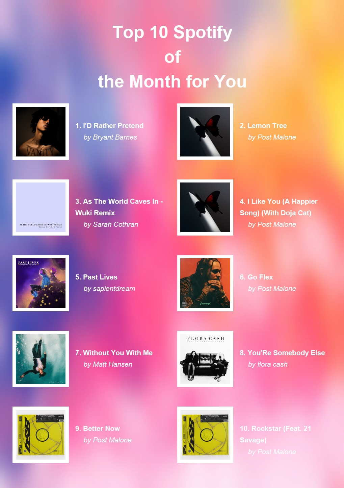
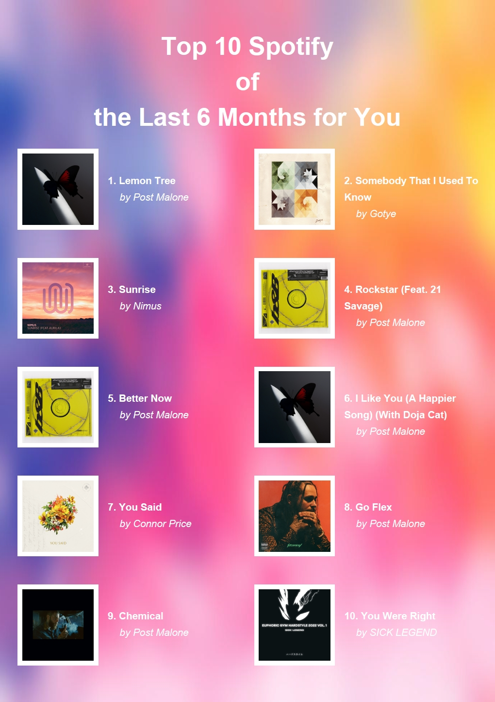
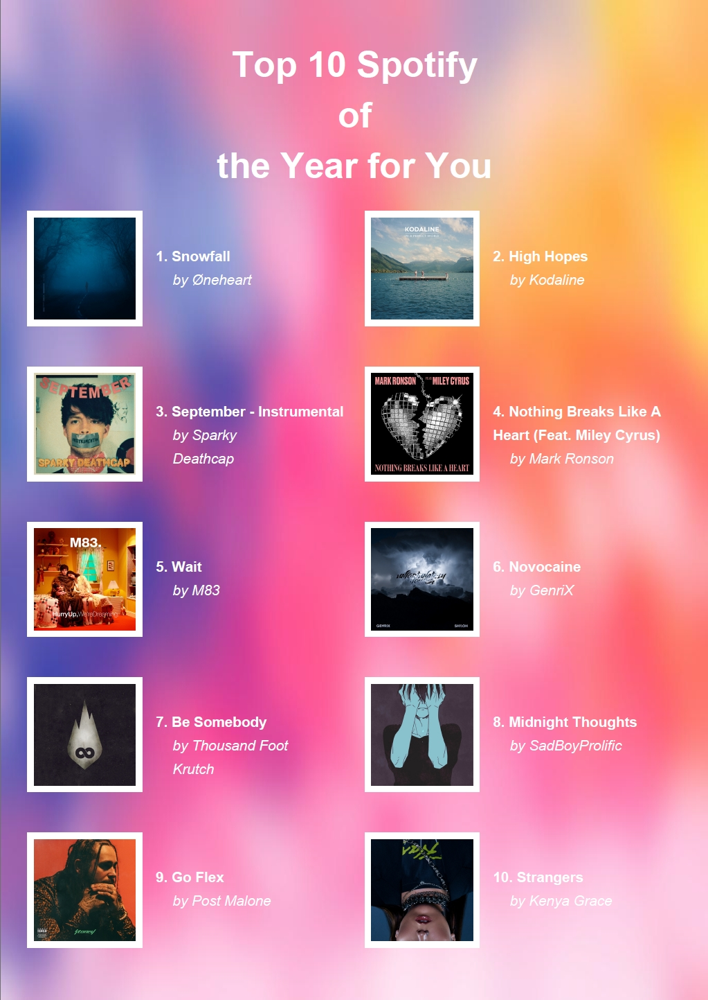

# Top10-spotify

This project allows users to generate a PDF with their top 10 Spotify tracks, including album covers and artist names. The PDF layout adapts based on user input (short, mid, or long-term data).

## Getting Started

### [Youtube Presentation](https://youtu.be/nG9AN5XZ674)

### Prerequisites

1. Python 3
2. Spotify Developer account
3. Required Python packages:
    - Spotipy
    - requests
    - FPDF
    - dotenv

## Setup

1. **Create Spotify API credentials**:
   - Sign up for a [Spotify Developer Account](https://developer.spotify.com/dashboard) and create a new app to get your **Client ID** and **Client Secret**.
2. **Create a `.env` file**:
   Add your credentials to a `.env` file like this:

   ```plaintext
   CLIENT_ID='Your Client ID'
   CLIENT_SECRET='Your Client Secret'
    ```

## Running the Script

1. Install the required dependencies:

   ```plaintext
    pip install -r requirements.txt
    ```
2. Run the script:

    ```plaintext
    python your_script_name.py
    ```
3. Enter the time range when prompted (long, mid, or short).
4. The generated PDF will show your top 10 tracks along with album covers.

## Description

#### Description:

This project generates a personalized PDF document displaying the user's top 10 tracks from Spotify. It utilizes the Spotipy library to interact with the Spotify Web API, allowing for secure access to user data.

1. **User Authentication**: The script prompts users to authenticate their Spotify account, granting access to their top track data. The authentication process is facilitated through a secure OAuth flow, which stores the user's connection token locally for future API requests.

2. **Customizable Time Range**: Users can specify a time range for which they want to retrieve their top tracks—options include "short" (the past month), "mid" (the last six months), and "long" (the past year). Based on this input, the script dynamically adjusts the PDF title and retrieves the relevant data from the Spotify API.

3. **Track Data Processing**: The information retrieved includes the track names, artist names, and album cover images. Each cover image is downloaded to a temporary file, ensuring that it is used efficiently without unnecessary data storage.

4. **PDF Generation**: Using the FPDF library, the script creates a visually appealing PDF. The album covers are positioned in alternating columns based on their index (even or odd), while the track names and artist names are neatly formatted. If a track name is too long, it automatically wraps to the next line, ensuring readability.

5. **Token Management**: After the PDF is generated, the user's authentication token is securely deleted from the local cache. Additionally, users are informed about how to revoke access to the application via their Spotify account settings.

6. **Visual Output**: The final output includes a title page, with images displaying the top tracks in a clear and organized layout, making it easy for users to share or print their Spotify top tracks in an attractive format.


### Result Examples

Below are some generated PDFs from the app: 

